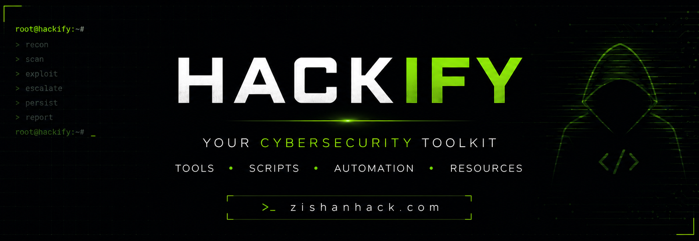

# Hackify por Zishan Ahamed Thandar

Hackify es un script de código abierto para sistemas operativos basados en Debian, escrito en bash. Este script agiliza la instalación de listas de palabras y herramientas de pentesting con un solo comando, facilitando que entusiastas y profesionales de la ciberseguridad configuren su entorno de pentesting de manera rápida y eficiente.

[](https://github.com/ZishanAdThandar/hackify)
[](https://zishanhack.com/links/)



- [Comando de instalación (Herramientas y Wordlist)](#installation-command)
- [Docker](#dockers)
- [Instalación manual](#manual-install)
- [Temas de Firefox](#firefox-themes)
- [Complemento de Firefox](#firefox-addon)

## Comando de instalación

```bash
git clone https://github.com/ZishanAdThandar/hackify.git
cd hackify
chmod +x hackify.sh
bash hackify.sh
# Para instalar wordlists
chmod +x wordlist.sh
bash wordlist.sh
```

## Docker
- [https://hub.docker.com/r/kasmweb/remnux-focal-desktop](https://github.com/ZishanAdThandar/hacknotes/tree/main/RevEng)
- BloodHound
  - Descargar el archivo compose `mkdir /opt/bloodhoundce && curl -ks https://raw.githubusercontent.com/SpecterOps/BloodHound/main/examples/docker-compose/docker-compose.yml > /opt/bloodhoundce/bloodhound-docker-compose.yml`
  - Ir a la carpeta `sudo cd /opt/bloodhoundce`
  - Extraer imágenes `sudo docker-compose -f bloodhound-docker-compose.yml up -d`
  - Comprobar Docker `docker logs bloodhoundce-bloodhound-1 |grep "Initial Password Set To"` # la primera vez tun proporcionará una contraseña temporal
  - Abre http://127.0.0.1:8080 o http://localhost:8080 y usa el nombre de usuario admin y la contraseña del registro, luego establece una nueva contraseña.

- Ciphey `docker run -it --rm remnux/ciphey`

## Instalación manual
- Criptografía: [Ciphey](https://github.com/bee-san/Ciphey), [Katana](https://github.com/JohnHammond/katana) 
- Web: [Arachni](https://github.com/Arachni/arachni/wiki/Installation#linux), Acunetix, BurpSuitePro
- OSINT y Reconocimiento: [theHarvester](https://github.com/laramies/theHarvester), [FinalRecon](https://github.com/thewhiteh4t/FinalRecon), [Recon-ng](https://github.com/lanmaster53/recon-ng), [SpiderFoot](https://github.com/smicallef/spiderfoot)
- Ingeniería inversa: [ghidra](https://github.com/NationalSecurityAgency/ghidra/releases/tag/Ghidra_11.3.2_build), [radare GUI](https://github.com/radareorg/iaito)
- AD: [bloodhound](https://github.com/SpecterOps/BloodHound), [BaldHead: AD Automate](https://github.com/ahmadallobani/BaldHead)
- Móvil: Android Studio, MobSF, Frida, 

## Temas de Firefox
- [CyberTerminus Theme](https://addons.mozilla.org/en-US/firefox/addon/zishanadthandar-cyberterminus/)
- [MrRobot Theme](https://addons.mozilla.org/en-US/firefox/addon/mrrobothacker/)

## Complemento de Firefox
- [Burp Suite Proxy Switch](https://addons.mozilla.org/en-US/firefox/addon/burp-proxy-toggler-lite/?utm_source=addons.mozilla.org&utm_medium=referral&utm_content=search)

## Tema (Preferencia personal)
- Plank Dock
- Fondo de pantalla de color sólido oscuro
- agregar monitor genérico `apt install xfce4-genmon-plugin -y` (para el escritorio XFCE) al panel para obtener las IPs con el código `sh -c 'ip a | grep -q "tun0" && ip -4 addr show tun0 | awk "/inet/ {print \$2}" | cut -d/ -f1 || curl -s ifconfig.me'`

- Reloj Conky
  - Instalar Conky con `apt install conky-all -y` o `apt install conky -y`
  - Reemplaza `alignment` para la posición, `location` para la ubicación del clima y `timezones` si es necesario
  - `~/.conkyrc`, `/etc/conky/conky.conf`, ` ~/.config/conky/conky.conf`
  - [Sample Conky.conf](configs/conky.conf)

## Problemas conocidos
- En ParrotOS, está interfiriendo con `Network Manager`.

## Estado de las pruebas
✅ **Linux Mint 22.3 Zena** (Probado el 8 de marzo de 2026)


---

> [!WARNING] 
> Usa esta herramienta bajo tu propia responsabilidad. 
> El mal uso de esta herramienta o de las herramientas instaladas puede provocar complicaciones legales.
