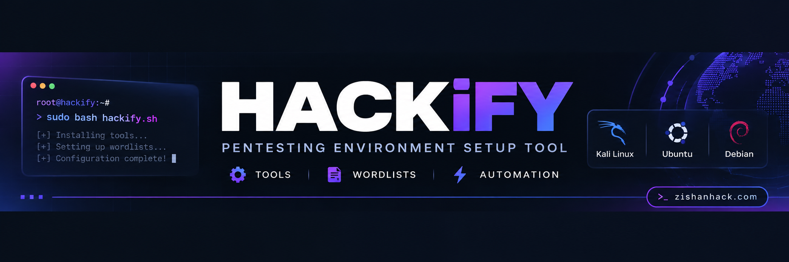

# Hackify by Zishan Ahamed Thandar

Hackify is an open-source script for Debian-based operating systems, coded in bash. This script streamlines the installation of pentesting wordlists and tools with a single command, making it easier for cybersecurity enthusiasts and professionals to set up their pentesting environment quickly and efficiently.

[](https://zishanhack.com/links/)
[](https://zishanhack.com/about/)
[](https://zishanhack.com/about/)



- [Installation Command (Tools and Wordlist)](#installation-command)
- [Dockers](#dockers)
- [Manual Install](#manual-install)
- [Firefox Themes](#firefox-themes)
- [Firefox Addon](#firefox-addon)

## Installation Command

```bash
git clone https://github.com/ZishanAdThandar/hackify.git
cd hackify
chmod +x hackify.sh
bash hackify.sh
# To install wordlists
chmod +x wordlist.sh
bash wordlist.sh
# To improve theme 
chmod +x theme.sh
bash theme.sh
```

## Dockers
- [https://hub.docker.com/r/kasmweb/remnux-focal-desktop](https://github.com/ZishanAdThandar/hacknotes/tree/main/RevEng)
- BloodHound
  - Download the compose file `mkdir /opt/bloodhoundce && curl -ks https://raw.githubusercontent.com/SpecterOps/BloodHound/main/examples/docker-compose/docker-compose.yml > /opt/bloodhoundce/bloodhound-docker-compose.yml`
  - Goto the folder `sudo cd /opt/bloodhoundce`
  - pull images `sudo docker-compose -f bloodhound-docker-compose.yml up -d`
  - Start Docker `docker logs bloodhoundce-bloodhound-1 |grep "Initial Password Set To"` # first time tun will give temp password
  - Open http://127.0.0.1:8080 or http://localhost:8080 and use username admin and password from log, then set new password.

- Ciphey `docker run -it --rm remnux/ciphey`

## Manual Install
- Crypto Graphy: [Ciphey](https://github.com/bee-san/Ciphey), [Katana](https://github.com/JohnHammond/katana) 
- Web: [Arachni](https://github.com/Arachni/arachni/wiki/Installation#linux), Acunetix, BurpSuitePro
- OSINT and Recon: [theHarvester](https://github.com/laramies/theHarvester), [FinalRecon](https://github.com/thewhiteh4t/FinalRecon), [Recon-ng](https://github.com/lanmaster53/recon-ng), [SpiderFoot](https://github.com/smicallef/spiderfoot)
- Reverse: [ghidra](https://github.com/NationalSecurityAgency/ghidra/releases/tag/Ghidra_11.3.2_build), [radare GUI](https://github.com/radareorg/iaito)
- AD: [bloodhound](https://github.com/SpecterOps/BloodHound), [BaldHead: AD Automate](https://github.com/ahmadallobani/BaldHead)
- Mobile: Android Studio, MobSF, Frida, 

## Firefox Themes
- [CyberTerminus Theme](https://addons.mozilla.org/en-US/firefox/addon/zishanadthandar-cyberterminus/)
- [Soft Dark for eye comfort](https://addons.mozilla.org/en-US/firefox/addon/soft-dark-zishanadthandar/)
- [MrRobot Theme](https://addons.mozilla.org/en-US/firefox/addon/mrrobothacker/)

## Firefox Addon
- [Hacker Proxy Pro](https://addons.mozilla.org/en-US/firefox/addon/hackerproxypro/)
- [Recon Kit](https://addons.mozilla.org/en-US/firefox/addon/reconkit/)

## Theme (Personal preference)
- Plank Dock
- add generic monitor `apt install xfce4-genmon-plugin -y` (for XFCE Desktop) to the panel to get IPs with code `sh -c 'ip a | grep -q "tun0" && ip -4 addr show tun0 | awk "/inet/ {print \$2}" | cut -d/ -f1 || curl -s ifconfig.me'`


## Test Status
- ✅ **Linux Mint 22.3 Zena** (Tested September, 2026)
- ✅ **Kali Linux VMWare** (Tested September, 2026)

> [!CAUTION]
> In ParrotOS, running hackify is breaking `Network Manager`. (Tested March, 2026)


> [!WARNING] 
> Use this tool at your own risk. 
> Misuse of this tool or installed tool can lead to legal complications.


